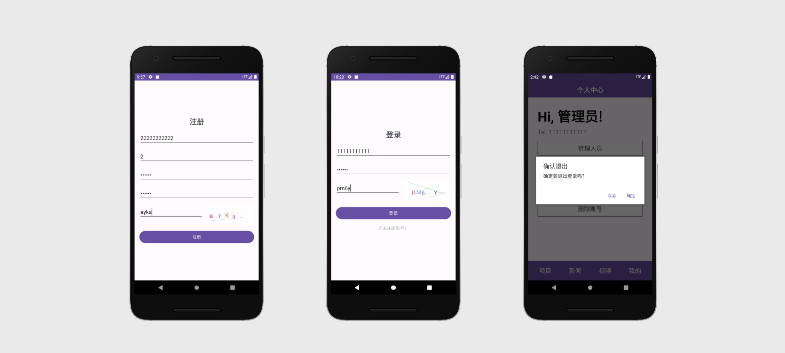
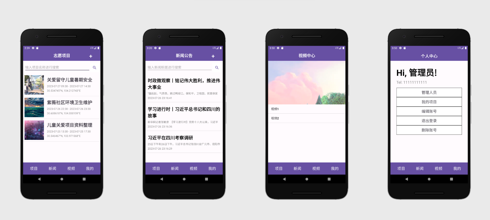
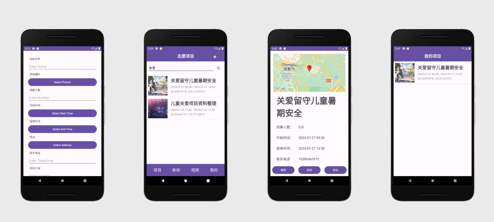
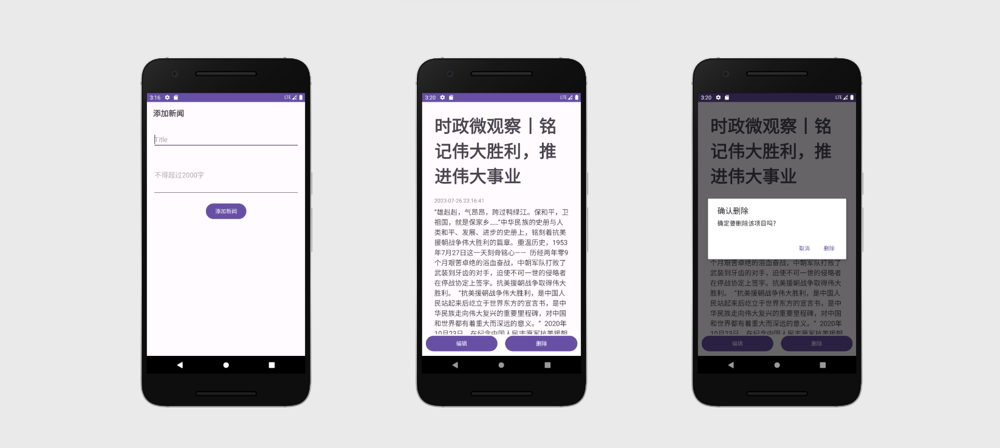
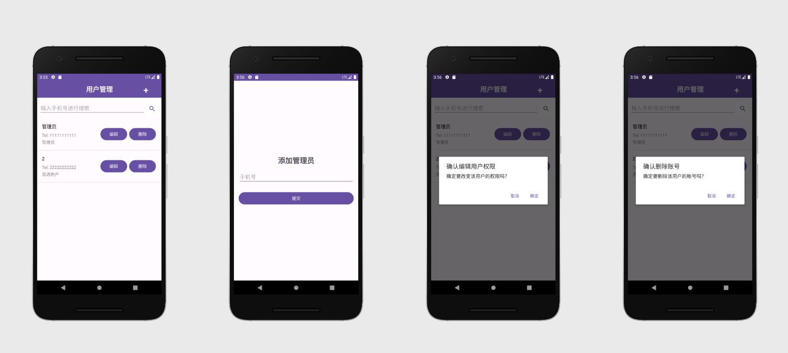
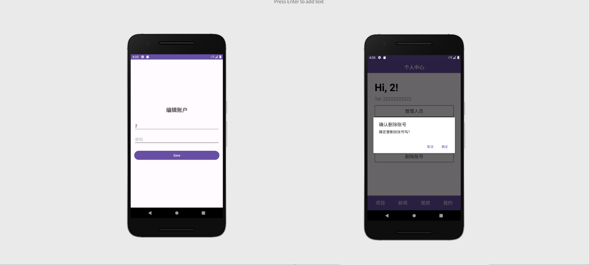

# VolunteerApp


## 1. 介绍

Volunteer是一个提供基础志愿服务相关功能的Android应用程序。它提供了用户管理、志愿项目管理、新闻公告管理、参与志愿项目、活动地图、视频中心等功能。

## 2. API

谷歌地图

> 提供志愿服务的地址。（可能需要代理）

## 3. 数据库

由于实习时间比较紧，所以使用SQLite数据库，使用本地存储避免写服务端代码。

DatabaseHelper类实现连接数据库与初始化数据库。

```java
public class DatabaseHelper extends SQLiteOpenHelper {
    private static final String DATABASE_NAME="volunteer.db";  //database name
    private static final int DATABASE_VERSION=1;  //database version
    
    public DatabaseHelper(Context context) {
        super(context, DATABASE_NAME, null, DATABASE_VERSION);
        // TODO Auto-generated constructor stub
    }

    @Override
    public void onCreate(SQLiteDatabase db) {
        // create table
        db.execSQL("CREATE TABLE activity (Aid INTEGER PRIMARY KEY AUTOINCREMENT, name VARCHAR(50), start_time DATETIME, end_time DATETIME, address VARCHAR(50), content VARCHAR(255), number INTEGER, telephone VARCHAR(11), picture TEXT)");
        db.execSQL("CREATE TABLE user (Pid INTEGER PRIMARY KEY, name VARCHAR(50),password VARCHAR(50),role INTEGER)");
        db.execSQL("CREATE TABLE participate (Aid INTEGER, Pid INTEGER)");
        db.execSQL("CREATE TABLE news (Nid INTEGER PRIMARY KEY AUTOINCREMENT, name VARCHAR(50), content TEXT, time DATETIME)");

        // add initial admin
        ContentValues adminValues = new ContentValues();
        adminValues.put("Pid", "11111111111");
        adminValues.put("name", "管理员");
        adminValues.put("password", "123456");
        adminValues.put("role", 1);

        long rowId = db.insert("user", null, adminValues);
    }
    
    @Override
    public void onUpgrade(SQLiteDatabase db, int oldVersion, int newVersion) {
        // TODO Auto-generated method stub
        System.out.println("---VersionUpdate---"+oldVersion+"--->"+newVersion);
    }
}
```

可以修改一下DatabaseHelper避免每次修改表结构都需要删除数据库。

## 4. 功能

- 用户相关功能

  > 注册、登录、登出、修改信息、删除账号、管理员增删改查用户。
  >
  > 注意：默认注册为普通用户，管理员用户只能由管理员添加。
  >
  > 初始管理员账号：11111111111，密码123456。添加的管理员默认密码也是123456。

- 志愿项目相关功能

  > 查找志愿项目、管理员增删改志愿项目、参与/退出志愿项目、显示活动地图。
  >
  > 因为图方便所以活动地址显示的是经纬度，可以进一步修改。

- 新闻公告相关功能

  > 查找新闻公告、管理员增删改新闻公告。
  >
  > 新闻内容的样式排版可以进一步优化。

- 视频中心

  > 为了实习分数而临时增加的功能，是写死的，只能看视频。

## 5. 开发和配置

### 环境

Language: Java

IDE: AndroidStudio 2022

### 如何运行

下载项目，在AndroidStudio上运行。

### API

 必须提供自己的谷歌地图 API 密钥，才能连接并从中获取数据。 

 创建一个 API，并将密钥放入此处 `AndroidManifest.xml`的`application`中。

```xml
<meta-data
            android:name="com.google.android.geo.API_KEY"
            android:value="Your API_KEY" />
```

## 6. 屏幕截图

### 注册、登录与登出



### 志愿项目/新闻公告/视频中心/个人中心



### 志愿项目相关功能



### 新闻公告增删改查



### 用户增删改查

管理员操作其他用户：



用户操作自身账户：

